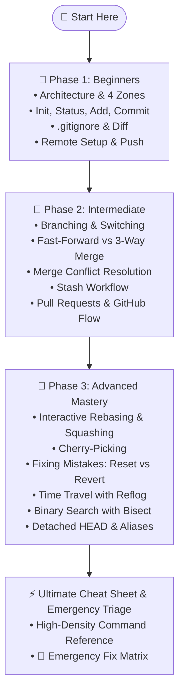

# 🚀 The Ultimate Git & GitHub Tutorial

<div align="center">

[](https://git-scm.com/)
[](https://github.com/)
[](https://opensource.org/licenses/MIT)
[](https://github.com/livelyfun/Git-Github_Tutorial/pulls)

**From your very first `git init` to untangling complex rebases and recovering lost commits.**  
*A comprehensive, practical, and beginner-to-advanced roadmap for mastering version control.*

</div>

---

## 🧭 Navigation & Learning Roadmap



### 📚 Course Index

| Phase | Guide | Key Topics |
| :--- | :--- | :--- |
| **01** | [🌱 Phase 1: Beginners](git-tutorial-beginner.md) | Git architecture (4 zones), `init`, `status`, `add`, `commit`, `.gitignore`, `diff`, GitHub remotes |
| **02** | [🌿 Phase 2: Intermediate](git-tutorial-intermediate.md) | Branching, merging strategies, resolving merge conflicts, `stash`, PR workflow, team collaboration |
| **03** | [🌳 Phase 3: Advanced](git-tutorial-advanced.md) | Rebasing, squash commits, `cherry-pick`, `reflog` recovery, `bisect`, detached HEAD, Git aliases |
| **REF** | [⚡ Ultimate Cheat Sheet](git-github-commands-cheatsheet.md) | Full command index + **🚨 Git Emergency Room** triage guide for quick rescue |

---

## 🛠️ Prerequisites & Setup

Before writing any code, you will need a free GitHub account, Git installed on your system, and secure authentication configured.

### 1. Create a GitHub Account
1. Visit [GitHub.com](https://github.com/).
2. Click **Sign up** in the top-right corner.
3. Follow the prompts to enter your email, create a secure password, and select a username.
4. Verify your email address.

---

### 2. Install Git on Your Operating System

<details open>
<summary><strong>🐧 Linux Distributions</strong></summary>

* **Arch Linux / Manjaro / EndeavourOS:**
  ```bash
  sudo pacman -S git
  ```
* **Ubuntu / Debian / Linux Mint / Pop!_OS:**
  ```bash
  sudo apt update && sudo apt install git
  ```
* **Fedora / RHEL / Rocky Linux:**
  ```bash
  sudo dnf install git
  ```
* **openSUSE:**
  ```bash
  sudo zypper install git
  ```
* **Alpine Linux:**
  ```bash
  apk add git
  ```
* **Gentoo:**
  ```bash
  emerge --ask dev-vcs/git
  ```
* **Void Linux:**
  ```bash
  sudo xbps-install -Su git
  ```
* **NixOS:**
  ```bash
  nix-env -iA nixpkgs.git
  ```
</details>

<details>
<summary><strong>🪟 Windows</strong></summary>

* **Official Standalone Installer (Includes Git Bash):** Download from [git-scm.com/download/win](https://git-scm.com/download/win)
* **Windows Package Manager (Winget):**
  ```powershell
  winget install --id Git.Git -e --source winget
  ```
* **Chocolatey:**
  ```powershell
  choco install git
  ```
* **Scoop:**
  ```powershell
  scoop install git
  ```
</details>

<details>
<summary><strong>🍏 macOS</strong></summary>

* **Homebrew (Recommended):**
  ```bash
  brew install git
  ```
* **Xcode Command Line Tools:**
  ```bash
  xcode-select --install
  ```
* **MacPorts:**
  ```bash
  sudo port install git
  ```
</details>

<details>
<summary><strong>😈 BSD Systems</strong></summary>

* **FreeBSD:** `pkg install git`
* **OpenBSD:** `pkg_add git`
* **NetBSD:** `pkgin install git`
</details>

---

### 3. Configure Git Identity

After installation, tell Git your name and email. These credentials will be attached to every commit you make:

```bash
git config --global user.name "Your Full Name"
git config --global user.email "your.email@example.com"
```

> [!TIP]
> **Set Your Default Branch & Preferred Editor:**
> ```bash
> git config --global init.defaultBranch main
> git config --global core.editor "code --wait" # For VS Code (or 'nano', 'vim')
> ```

---

### 4. Authenticate with GitHub (SSH Setup)

GitHub no longer accepts account passwords when pushing over HTTPS. The most secure and convenient method is using an **SSH key**.

#### Step A: Generate an SSH Key
Open your terminal and run:
```bash
ssh-keygen -t ed25519 -C "your.email@example.com"
```
*(Press `Enter` to accept the default file location and optionally provide a passphrase).*

#### Step B: Copy Your Public Key
* **Linux:** `cat ~/.ssh/id_ed25519.pub` (or `xclip -sel clip < ~/.ssh/id_ed25519.pub`)
* **macOS:** `pbcopy < ~/.ssh/id_ed25519.pub`
* **Windows (Git Bash):** `cat ~/.ssh/id_ed25519.pub | clip`

#### Step C: Add the Key to GitHub
1. Go to **GitHub.com** → **Settings** (top right profile icon) → **SSH and GPG keys**.
2. Click **New SSH key**.
3. Give it a descriptive Title (e.g., `Arch-Laptop`) and paste your key into the **Key** field.
4. Click **Add SSH key**.

#### Step D: Test Connection
```bash
ssh -T git@github.com
# Expected output: "Hi username! You've successfully authenticated..."
```

---

## 💻 Clone & Practice Locally

You can read this tutorial directly on GitHub or clone this repository to practice locally:

### Option 1: Using SSH (Recommended)
```bash
git clone git@github.com:livelyfun/Git-Github_Tutorial.git
cd Git-Github_Tutorial
```

### Option 2: Using HTTPS
```bash
git clone https://github.com/livelyfun/Git-Github_Tutorial.git
cd Git-Github_Tutorial
```

### Option 3: Using GitHub CLI (`gh`)
```bash
gh repo clone livelyfun/Git-Github_Tutorial
cd Git-Github_Tutorial
```

---

## 🚀 Get Started Now

Ready to begin? Jump straight into [🌱 Phase 1: Git & GitHub for Beginners](git-tutorial-beginner.md)!

---

## 🤝 Contributing

Contributions make the open-source community an amazing place to learn, inspire, and create. Any contributions you make are **greatly appreciated**!

1. **Fork** the Project
2. Create your Feature Branch (`git checkout -b feature/AmazingTrick`)
3. Commit your Changes (`git commit -m "feat: add interactive rebase tips"`)
4. Push to the Branch (`git push origin feature/AmazingTrick`)
5. Open a **Pull Request**

---

<div align="center">
  <b>Happy Coding! 🎉</b><br/>
  <sub>Maintained with ❤️ by livelyfun and contributors.</sub>
</div>
