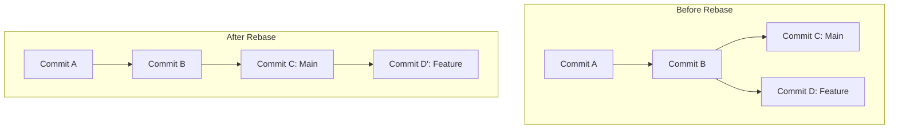

# 🌳 Phase 3: Git & GitHub - Advanced Mastery

Welcome to Phase 3. Here you will learn how to rewrite history, pinpoint obscure bugs, and fix critical mistakes. 

⚠️ *Golden Rule of Advanced Git: Never rewrite history (rebase, reset) on commits that have already been pushed to a public repository that others are using.*

## 🏗️ Rebasing (An alternative to Merging)
Merging creates a "merge commit" tying two branches together. **Rebasing** rewrites history by physically moving your feature branch to start at the very tip of the updated `main` branch. It creates a perfectly straight, linear history.



**How to execute:**
```bash
git switch feature-branch
git rebase main
```

## 🪄 Interactive Rebase (Cleaning up your mess)
Did you make 5 tiny, messy commits like "fix typo", "fix typo again", "oops"? You can squash them into one beautiful commit before merging.
```bash
git rebase -i HEAD~3  # Modifies the last 3 commits
```
This opens an editor. Change the word `pick` to `squash` (or `s`) next to the commits you want to combine into the one above it.

## 🍒 Cherry-Picking
Sometimes you just want one specific commit from another branch without merging the whole thing (e.g., pulling a crucial security fix from a test branch into main).
```bash
git cherry-pick <commit-hash>
```

## ⏪ Undoing Mistakes (The Big Guns)

### 1. `git revert` (The Safe Way)
Instead of deleting history, this adds a *new* commit that perfectly undoes a past mistake. Excellent for public repos.
```bash
git revert <commit-hash>
```

### 2. `git reset` (The Dangerous Way)
This physically winds the clock backward, erasing commits from history.
* `git reset --soft HEAD~1`: Deletes the last commit, but puts all the files back into your Staging Area. (Great for "I forgot to add one file to that commit!").
* `git reset --hard HEAD~1`: **DESTROYS** the last commit and all the code changes within it. Use with extreme caution.

### 3. `git reflog` (The Safety Net)
Did you accidentally do a `--hard` reset and lose your work? Git silently records *everything* you do for about 30 days.
```bash
git reflog
```
Find the hash of where you were before you messed up, and run `git reset --hard <hash>` to resurrect your lost commits!

## 🐞 Bug Hunting with Git Bisect
If a bug was introduced somewhere in the last 50 commits, testing each one is tedious. `bisect` uses binary search to find the exact commit that broke the code in seconds.
```bash
git bisect start
git bisect bad                 # Tell Git the current state is broken
git bisect good <commit-hash>  # Give Git an old commit hash where things worked
```
Git will automatically jump you to the middle commit. Run your code. If it works, type `git bisect good`. If it's broken, type `git bisect bad`. Git will keep narrowing it down until it points to the exact commit that caused the bug.
