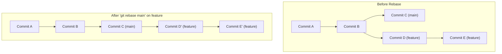
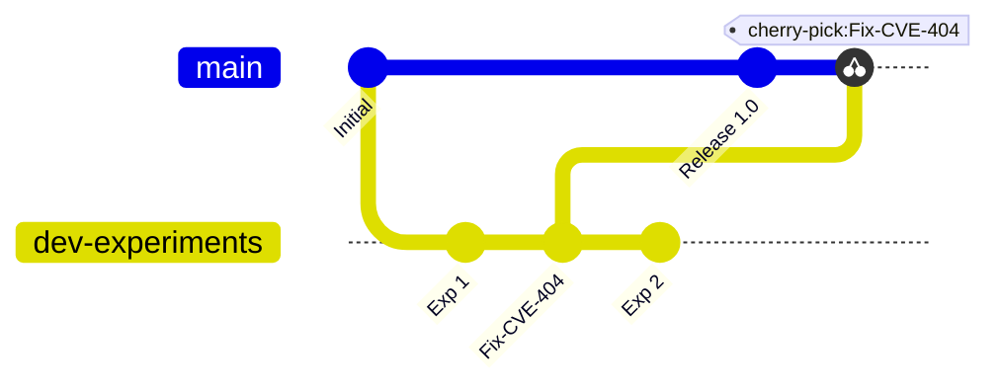
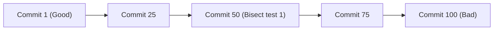

# 🌳 Phase 3: Git & GitHub - Advanced Mastery

<div align="center">

[⬅️ Phase 2: Intermediate](git-tutorial-intermediate.md) &nbsp;•&nbsp; **Phase 3: Advanced Mastery** &nbsp;•&nbsp; [⚡ Cheat Sheet ➡️](git-github-commands-cheatsheet.md)

</div>

---

Welcome to **Phase 3**! This is where you transition from a regular Git user to a Git power user. In this module, you will learn how to rewrite history, squash messy commits, surgically extract changes, debug with binary search, and rescue deleted branches with `reflog`.

---

## 🏗️ 1. Rebasing vs Merging (Linear History)

While `git merge` creates a merge commit tying divergent branches together, **`git rebase`** takes your entire feature branch and replays its commits one by one on top of the newest commit of the target branch.


```mermaid
flowchart TD
    subgraph "Before Rebase"
        A["Commit A"] --> B["Commit B"] --> C["Commit C (main)"]
        B --> D["Commit D (feature)"] --> E["Commit E (feature)"]
    end

    subgraph "After 'git rebase main' on feature"
        A1["Commit A"] --> B1["Commit B"] --> C1["Commit C (main)"] --> D1["Commit D' (feature)"] --> E1["Commit E' (feature)"]
    end
```

### ⚠️ The Golden Rule of Rebasing
> **Never rebase commits that have already been pushed to a public/shared remote repository!**  
> Rebasing creates brand-new commit hashes. If your teammates have based work on the old commits, rebasing will create duplicate commits and cause merge chaos. Only rebase local, un-pushed feature branches.

### Executing a Rebase:
```bash
# 1. Update your local main branch
git switch main
git pull origin main

# 2. Switch to your feature branch and rebase on top of main
git switch feature-payment
git rebase main

# 3. If conflicts occur:
# - Fix conflicts in files
# - git add <fixed-files>
# - git rebase --continue
# (Or cancel anytime with: git rebase --abort)
```

---

## 🪄 2. Interactive Rebasing (Squashing & Cleaning)

Interactive rebase (`git rebase -i`) lets you rewrite, reorder, edit, or combine commits before merging them into `main`.

```bash
# Open interactive rebase for the last 4 commits
git rebase -i HEAD~4
```

An editor will open displaying your commits with command keywords:

```text
pick 4a8b1c2 feat: add payment form markup
pick 9f3e2a1 fix: typo in card number input
pick 7c5d3e0 style: add border radius to checkout button
pick 1d2e3f4 test: add unit test for payment validation
```

### Action Keywords Reference:
| Command | Shorthand | What It Does |
| :--- | :---: | :--- |
| **`pick`** | `p` | Keep the commit as is. |
| **`reword`** | `r` | Keep commit contents, but edit the commit message. |
| **`edit`** | `e` | Pause the rebase to let you amend files or split commits. |
| **`squash`** | `s` | Melds the commit into the previous commit and combines messages. |
| **`fixup`** | `f` | Melds commit into previous commit, discarding this commit's message. |
| **`drop`** | `d` | Deletes the commit entirely from history. |

### Example: Squashing into One Clean Commit
Change `pick` to `squash` (or `fixup`) on the subsequent commits:
```text
pick 4a8b1c2 feat: implement payment checkout system
squash 9f3e2a1 fix: typo in card number input
fixup 7c5d3e0 style: add border radius to checkout button
squash 1d2e3f4 test: add unit test for payment validation
```
Save and close the editor. Git will squash the 4 commits into 1 clean, professional commit!

---

## 🍒 3. Cherry-Picking (Surgical Commit Extraction)

What if a developer fixed a critical security bug on a temporary development branch, and you need that exact fix in `main` **without** merging all their incomplete experimental work?

Use **`git cherry-pick`**:


```mermaid
gitGraph
    commit id: "Initial"
    branch dev-experiments
    checkout dev-experiments
    commit id: "Exp 1"
    commit id: "Fix-CVE-404"
    commit id: "Exp 2"
    checkout main
    commit id: "Release 1.0"
    cherry-pick id: "Fix-CVE-404"
```

```bash
# Switch to the branch where you want the fix applied
git switch main

# Copy and apply the specific commit
git cherry-pick 8a7b6c5
```

---

## 👻 4. The "Detached HEAD" State Demystified

### What is Detached HEAD?
Normally, `HEAD` points to a named branch (e.g. `HEAD -> main`), and `main` points to the latest commit.  
When you checkout a specific commit hash or remote tag directly (`git checkout 8a7b6c5`), `HEAD` points directly to that commit rather than a branch.

```
HEAD ➔ [Commit 8a7b6c5]  (Detached - No branch pointer!)
```

### How to Handle Detached HEAD:
* **If you just wanted to look around / inspect code:**
  Simply switch back to your branch when done:
  ```bash
  git switch main
  ```
* **If you made experimental commits while detached and want to keep them:**
  Create a new branch right where you are:
  ```bash
  git switch -c recovered-experiment
  ```

---

## ⏪ 5. Undoing Disasters: Reset, Revert & Reflog

### Comparing Undoing Tools
| Tool | Destructive? | Safe for Public Repos? | Description |
| :--- | :---: | :---: | :--- |
| **`git revert <hash>`** | ❌ No | ✅ Yes | Creates a *new* commit that reverses the changes of an old commit. |
| **`git reset --soft`** | ❌ No | ❌ No | Moves branch pointer back; leaves changes **Staged**. |
| **`git reset --mixed`** | ❌ No | ❌ No | Default. Moves branch pointer back; leaves changes **Unstaged**. |
| **`git reset --hard`** | ⚠️ **YES** | ❌ No | **Destroys** commit history AND working directory changes. |

---

### 🛡️ The Ultimate Safety Net: `git reflog`
Git almost never deletes anything immediately. Whenever `HEAD` moves (commits, resets, rebases, checkouts), Git logs it in the **Reference Log (`reflog`)**.

#### Recipe: Resurrecting an Accidentally Deleted Branch or Bad Hard Reset
1. Run `git reflog`:
   ```text
   7a1b2c3 HEAD@{0}: reset: moving to HEAD~1
   9f8e7d6 HEAD@{1}: commit: feat: awesome work that vanished
   ```
2. Find the hash right before the mistake occurred (`9f8e7d6`).
3. Restore it immediately by creating a branch on that hash:
   ```bash
   git branch recovered-work 9f8e7d6
   git switch recovered-work
   ```
   *Your deleted work is 100% restored!*

---

## 🐞 6. Bug Hunting with `git bisect` (Binary Search)

If an obscure bug was introduced somewhere in the last 100 commits, testing each commit manually takes hours. `git bisect` finds the culprit commit in $\approx \log_2(N)$ steps (only ~7 tests for 100 commits!).


```mermaid
flowchart LR
    A["Commit 1 (Good)"] --> B["Commit 25"] --> C["Commit 50 (Bisect test 1)"] --> D["Commit 75"] --> E["Commit 100 (Bad)"]
```

### Manual Bisect Workflow:
```bash
# 1. Start bisect mode
git bisect start

# 2. Mark current state as broken
git bisect bad

# 3. Mark a known working commit hash from the past
git bisect good v1.0.0

# 4. Git will check out the middle commit automatically.
# Test your application!
# If it works:
git bisect good
# If it fails:
git bisect bad

# 5. Repeat until Git prints: "[hash] is the first bad commit"
# 6. Exit bisect mode and return to main:
git bisect reset
```

### Automated Bisect with Test Scripts:
If you have an automated test script (e.g. `npm test` or `pytest`), Git can do the entire binary search automatically in 2 seconds:
```bash
git bisect start HEAD v1.0.0
git bisect run npm test
git bisect reset
```

---

## ⚡ 7. Power User Tools: Productivity Aliases

Boost your daily terminal speed by setting up handy Git aliases in `~/.gitconfig`:

```bash
# Status and navigation
git config --global alias.st status
git config --global alias.co switch
git config --global alias.cb "switch -c"
git config --global alias.br branch

# Visual Graph History
git config --global alias.lg "log --graph --pretty=format:'%Cred%h%Creset -%C(yellow)%d%Creset %s %Cgreen(%cr) %C(bold blue)<%an>%Creset' --abbrev-commit"

# Unstage helper
git config --global alias.unstage "restore --staged"
```

Now typing `git lg` produces a colorful, interactive commit tree!

---

## 🎯 Phase 3 Knowledge Check

Congratulations! You have completed the advanced curriculum. Make sure you understand:
- [x] When to use `git rebase` vs `git merge` (and the Golden Rule of Rebasing).
- [x] How to squash commits with `git rebase -i`.
- [x] How to cherry-pick specific commits.
- [x] How to rescue lost commits and branches with `git reflog`.
- [x] How to locate bug regressions using `git bisect`.

---

<div align="center">

[⬅️ Back to Phase 2](git-tutorial-intermediate.md) &nbsp;•&nbsp; **[Jump to the Ultimate Cheat Sheet & Emergency Room ➡️](git-github-commands-cheatsheet.md)**

</div>
