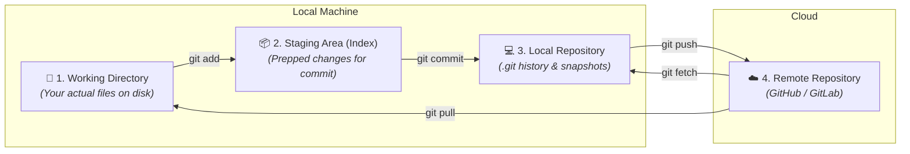

# 🌱 Phase 1: Git & GitHub for Beginners

<div align="center">

[⬅️ Home](README.md) &nbsp;•&nbsp; **Phase 1: Beginners** &nbsp;•&nbsp; [Phase 2: Intermediate ➡️](git-tutorial-intermediate.md) &nbsp;•&nbsp; [⚡ Cheat Sheet](git-github-commands-cheatsheet.md)

</div>

---

Welcome to **Phase 1**! Git can feel intimidating at first with its jargon and terminal commands, but beneath the surface, it works on a simple principle:

> **Git is a time machine and save-state system for your code.**  
> Every commit is a permanent snapshot of your project at a specific moment in time. If you break something, you can always travel back.

---

## 🗺️ 1. The Core Architecture (The 4 Zones)

To master Git, you need to understand where your files live at any given moment. Git moves code across **4 key zones**:



### The Life Cycle of a File
1. **Untracked:** Git sees the file in your folder, but it is not part of history yet.
2. **Modified:** You changed an existing tracked file in your working directory.
3. **Staged:** You marked the file changes with `git add` to be included in the next snapshot.
4. **Committed:** The staged snapshot is permanently recorded into the `.git` database.

---

## 🛠️ 2. First-Time Setup & Configuration

Before creating commits, configure your global identity so your teammates and GitHub know who authored each change:

```bash
# Set your name and email
git config --global user.name "Your Name"
git config --global user.email "your.email@example.com"

# Set default branch name to 'main'
git config --global init.defaultBranch main

# Verify your configuration
git config --list
```

---

## 🏁 3. Starting a Project

You can start a Git-tracked project in one of two ways:

### Option A: Create a Brand New Local Project (`git init`)
```bash
mkdir my-awesome-app
cd my-awesome-app
git init
```
> [!NOTE]
> `git init` creates a hidden `.git` folder in your directory. This folder is the "brain" containing all history, objects, and configuration. **Never delete `.git` unless you want to erase all version history!**

### Option B: Download an Existing GitHub Project (`git clone`)
```bash
git clone https://github.com/username/project-name.git
cd project-name
```

---

## 🔄 4. The Daily Git Workflow (The Core Loop)

You will execute this 4-step loop dozen of times every day:

```
[Edit Files] ➔ git status ➔ git diff ➔ git add ➔ git commit
```

### Step 1: Check Status (`git status`)
Always run `git status` before doing anything. It is your GPS in Git:
```bash
git status
```
*Output tells you:* Which branch you are on, what files are staged (green), and what files are modified/untracked (red).

---

### Step 2: Inspect Changes (`git diff`)
Before you stage files, inspect exactly what lines you added, changed, or deleted:
```bash
# View unstaged changes in working directory vs last commit
git diff

# View staged changes (what is about to be committed)
git diff --staged
```

---

### Step 3: Stage Changes (`git add`)
The Staging Area lets you curate which changes belong in the next commit:
```bash
# Stage a specific file
git add index.html

# Stage multiple specific files
git add styles.css app.js

# Stage ALL modified and new files in the project
git add .
```

---

### Step 4: Save Snapshot (`git commit`)
Wrap up staged changes into a permanent snapshot with a descriptive message:
```bash
git commit -m "feat: implement user registration form"
```

> [!TIP]
> ### 📝 Best Practice: Conventional Commits
> Clear commit messages make debugging and teamwork seamless. Use the standard prefixes:
> - `feat:` A brand new feature (`feat: add dark mode toggle`)
> - `fix:` A bug fix (`fix: resolve mobile navbar overflow`)
> - `docs:` Documentation changes only (`docs: update setup steps in README`)
> - `style:` Formatting, missing semicolons, no code logic changes (`style: format with prettier`)
> - `refactor:` Code restructuring without changing behavior (`refactor: simplify auth middleware`)
> - `chore:` Updating build tools, dependencies, configs (`chore: bump vite to v6.0`)

---

### Step 5: View History (`git log`)
```bash
# View standard full commit log
git log

# View clean, compact single-line history
git log --oneline

# View history with branch graphs
git log --oneline --graph --decorate -n 10
```

---

## 🙈 5. Ignoring Files with `.gitignore`

Not every file belongs in version control! You should **never** commit:
- API keys, secrets, `.env` files.
- Heavy build artifacts (`dist/`, `build/`, `target/`).
- Package dependencies (`node_modules/`, `venv/`, `vendor/`).
- Operating system cache files (`.DS_Store`, `Thumbs.db`).

### Creating a `.gitignore`
Create a file named `.gitignore` in your project root:

```gitignore
# Dependencies
node_modules/
__pycache__/
venv/

# Environment Variables & Secrets
.env
.env.local
*.pem
id_rsa

# Build outputs
dist/
build/
*.log

# OS temporary files
.DS_Store
Thumbs.db
```

> [!WARNING]
> **What if you already tracked a file you now want to ignore?**  
> Simply adding it to `.gitignore` won't remove it from Git's tracking. You must untrack it first:
> ```bash
> git rm --cached .env
> git commit -m "chore: stop tracking .env secret"
> ```

---

## ⏪ 6. Undoing Simple Mistakes in Phase 1

Made a mistake? Don't panic. Here are the most common early fixes:

### 1. Unstage a file you added by accident:
```bash
git restore --staged filename.js
```
*(Your file edits remain completely intact in your working directory; it is simply unstaged).*

### 2. Discard all unstaged changes in a file (revert to last commit):
```bash
git restore filename.js
```
*(⚠️ CAUTION: This discards your local edits since the last commit!)*

### 3. Fix the last commit message or add a forgotten file:
```bash
# Stage the forgotten file
git add forgotten-file.js

# Amend the last commit without creating a duplicate commit
git commit --amend -m "feat: complete user registration form"
```

---

## ☁️ 7. Connecting Local Code to GitHub

Once your local repository has commits, connect it to GitHub to share and back it up.

### 1. Create a Repository on GitHub
Go to [GitHub.com/new](https://github.com/new) and create a new, empty repository (do not initialize with README if you already have local files).

### 2. Add Remote URL & Push:
```bash
# Link local repo to GitHub (SSH syntax recommended)
git remote add origin git@github.com:your-username/my-awesome-app.git

# Verify remote configuration
git remote -v

# Rename current branch to 'main'
git branch -M main

# Push and set upstream tracking
git push -u origin main
```
> [!NOTE]
> The `-u` (or `--set-upstream`) flag links your local `main` branch to `origin/main`. In future sessions, you only need to type:
> ```bash
> git push    # to upload new commits
> git pull    # to download updates from GitHub
> ```

---

## 🎯 Phase 1 Knowledge Check

Before moving to Phase 2, make sure you can:
- [x] Explain the 4 Git zones (Working Dir, Staging, Local Repo, Remote).
- [x] Use `git status`, `git diff`, `git add`, and `git commit` comfortably.
- [x] Create a `.gitignore` file to ignore secrets and `node_modules`.
- [x] Push local commits to a GitHub remote with `git push -u origin main`.

---

<div align="center">

[⬅️ Back to Home](README.md) &nbsp;•&nbsp; **[Ready for the next step? Proceed to Phase 2: Intermediate ➡️](git-tutorial-intermediate.md)**

</div>
