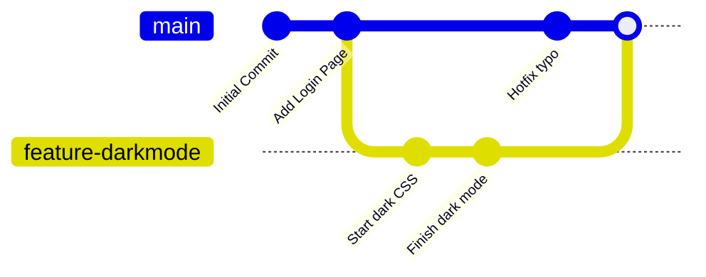

# 🌿 Phase 2: Git & GitHub - Intermediate

Welcome to Phase 2. When working alone, a single line of history is fine. But when working on new features or with a team, you need **Branches**.

## 🔀 Branching Explained
A branch is an independent timeline of your project. You can build a crazy new feature without breaking the stable code on the `main` branch.



## 🛠️ Essential Branching Commands
* **See all branches:** `git branch`
* **Create a new branch:** `git branch new-feature`
* **Switch to that branch:** `git switch new-feature`
* **Create AND switch (Shortcut):** `git switch -c new-feature`

## 🪢 Merging (Bringing it all together)
Once your `new-feature` is complete, you need to combine it with `main`.
1. Switch back to your stable branch: `git switch main`
2. Merge the feature branch into main: `git merge new-feature`

## ⚔️ Dealing with Merge Conflicts
Sometimes, Git panics. If you edited line 42 on `main`, and your teammate edited line 42 on `new-feature`, Git won't know which one to keep when you merge. This is a **Merge Conflict**.

1. Git will pause the merge and say `CONFLICT (content)`.
2. Open the affected file. You will see this:
   ```html
   <<<<<<< HEAD
   <h1>Welcome to our App!</h1>
   =======
   <h1>Welcome User!</h1>
   >>>>>>> new-feature
   ```
3. **The Fix:** Delete the `<<<<<`, `=====`, and `>>>>>` markers. Keep only the code you actually want.
4. Tell Git you fixed it:
   ```bash
   git add <the-fixed-file>
   git commit -m "Resolve merge conflict on homepage"
   ```

## 🎒 Stashing (The Quick Pocket)
Imagine you are halfway through coding a feature, and suddenly a critical bug needs fixing on `main`. You aren't ready to commit your half-broken feature code.
* **Hide your current work:** `git stash` (Your working directory is now clean!)
* **Switch branches and fix the bug:** `git switch main`
* **Come back to your feature:** `git switch new-feature`
* **Bring your half-finished work back:** `git stash pop`

## 🔍 Reading History
* `git log`: The standard history.
* `git log --oneline --graph --decorate`: A beautiful, compact visualization of your branches and commits right in the terminal.
