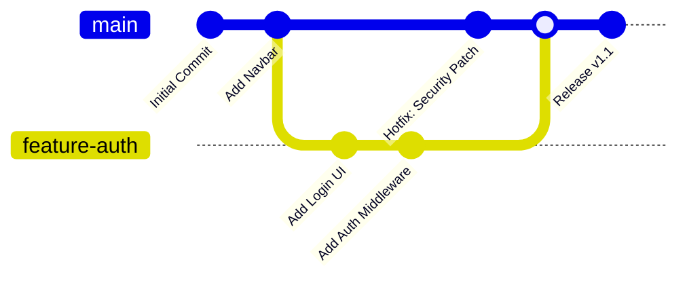
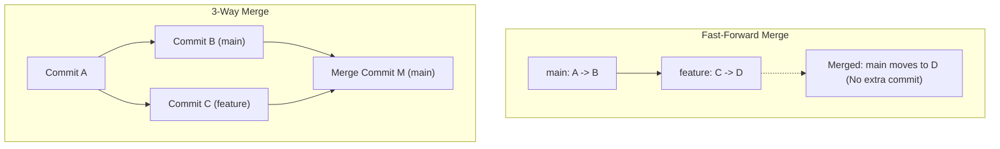
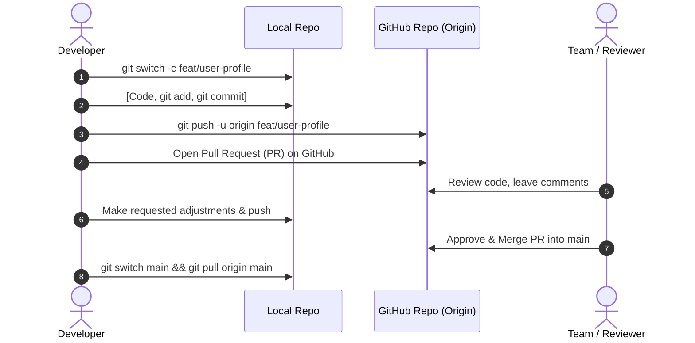

# 🌿 Phase 2: Git & GitHub - Intermediate

<div align="center">

[⬅️ Phase 1: Beginners](git-tutorial-beginner.md) &nbsp;•&nbsp; **Phase 2: Intermediate** &nbsp;•&nbsp; [Phase 3: Advanced ➡️](git-tutorial-advanced.md) &nbsp;•&nbsp; [⚡ Cheat Sheet](git-github-commands-cheatsheet.md)

</div>

---

Welcome to **Phase 2**! When you work alone, committing to a single `main` branch works for simple scripts. But in real-world software engineering, teams build multiple features simultaneously without breaking production code.

This phase is all about **Branches**, **Merging**, **Resolving Conflicts**, **Stashing**, and the **GitHub Pull Request (PR) workflow**.

---

## 🔀 1. What is a Branch?

In Git, a branch is simply a lightweight, movable pointer to a specific commit. When you create a branch, you fork off the main line of development to test ideas, build features, or fix bugs in complete isolation.


```mermaid
gitGraph
    commit id: "Initial Commit"
    commit id: "Add Navbar"
    branch feature-auth
    checkout feature-auth
    commit id: "Add Login UI"
    commit id: "Add Auth Middleware"
    checkout main
    commit id: "Hotfix: Security Patch"
    merge feature-auth
    commit id: "Release v1.1"
```

---

## 🛠️ 2. Comprehensive Branch Management

### Creating & Switching Branches
Modern Git uses the intuitive `git switch` command (introduced in Git 2.23 as a cleaner alternative to `git checkout`):

```bash
# List all local branches (the * indicates your active branch)
git branch

# List both local AND remote-tracking branches
git branch -a

# Create a new branch (stays on current branch)
git branch feature-login

# Switch to the existing branch
git switch feature-login

# CREATE and SWITCH in one single step (Recommended!)
git switch -c feature-login
```
*(Legacy alternative: `git checkout -b feature-login`)*

---

### Renaming & Deleting Branches
```bash
# Rename current active branch
git branch -m new-branch-name

# Safely delete a local branch (only if already merged)
git branch -d feature-login

# Force delete a local branch (discards unmerged commits)
git branch -D feature-login

# Delete a branch on GitHub remote
git push origin --delete feature-login

# Clean up local references to deleted remote branches
git fetch --prune
```

---

## 🪢 3. Merging (Bringing Timelines Together)

Once your feature branch is tested and ready, merge it back into `main`.

### Merge Workflow:
```bash
# 1. Switch to the target branch that receives the changes
git switch main

# 2. Pull the latest changes from GitHub just in case
git pull origin main

# 3. Merge the feature branch into main
git merge feature-login
```

### Fast-Forward vs 3-Way Merge
* **Fast-Forward Merge:** If `main` has not had any new commits since you branched off, Git simply slides the `main` pointer forward. No new merge commit is created.
* **3-Way Merge (Recursive / ORT):** If `main` has progressed with new commits while you were working on `feature-login`, Git combines both histories and creates a **Merge Commit** tying the two branches together.


```mermaid
flowchart TD
    subgraph "Fast-Forward Merge"
        FF1["main: A -> B"] --> FF2["feature: C -> D"]
        FF2 -.-> FF3["Merged: main moves to D (No extra commit)"]
    end
    
    subgraph "3-Way Merge"
        M1["Commit A"] --> M2["Commit B (main)"]
        M1 --> F1["Commit C (feature)"]
        M2 --> MC["Merge Commit M (main)"]
        F1 --> MC
    end
```

---

## ⚔️ 4. Resolving Merge Conflicts

When you and a teammate edit the exact same line of code in the same file on different branches, Git cannot guess whose code is correct. It will pause the merge and flag a **Merge Conflict**.

```
Auto-merging app.js
CONFLICT (content): Merge conflict in app.js
Automatic merge failed; fix conflicts and then commit the result.
```

### Anatomy of a Conflict Marker:
Open the conflicted file in your text editor. You will see markers inserted by Git:

```javascript
<<<<<<< HEAD
// Code on your current branch (e.g. main)
const API_URL = "https://api.production.com";
=======
// Code on the branch you are merging in (e.g. feature-login)
const API_URL = "https://auth.production.com/v2";
>>>>>>> feature-login
```

### Step-by-Step Conflict Resolution:
1. **Locate the markers:** Search for `<<<<<<<` in your files (or use VS Code's built-in "Accept Current", "Accept Incoming", or "Accept Both" buttons).
2. **Edit the file:** Delete the marker lines (`<<<<<<<`, `=======`, `>>>>>>>`) and keep the desired code.
   ```javascript
   const API_URL = "https://auth.production.com/v2";
   ```
3. **Stage the resolved file:**
   ```bash
   git add app.js
   ```
4. **Finalize the merge:**
   ```bash
   git commit -m "merge: resolve API_URL conflict between main and feature-login"
   ```

> [!TIP]
> **Want to cancel a scary merge?**  
> If a merge goes haywire and you want to return to where you started:
> ```bash
> git merge --abort
> ```

---

## 🎒 5. Stashing (The Temporary Pocket)

Imagine you are in the middle of writing unfinished code on `feature-cart`, and your manager asks you to immediately hotfix a bug on `main`. You don't want to make an ugly "half-done" commit.

Use **`git stash`** to temporarily shelve your uncommitted work:

```bash
# 1. Stash your dirty working directory with a helpful label
git stash push -m "WIP: cart checkout redesign"

# 2. Your directory is now clean! Switch to main and fix bug
git switch main
# ... fix bug, commit, push ...

# 3. Return to your feature branch
git switch feature-cart

# 4. View your saved stashes
git stash list

# 5. Restore your stashed changes and remove from stash list
git stash pop
```

### Additional Stash Utilities:
```bash
# Apply stash changes without deleting from the stash list
git stash apply

# Stash including untracked / newly created files
git stash -u

# Delete the most recent stash
git stash drop

# Clear all stashes completely
git stash clear
```

---

## 👥 6. The GitHub Collaboration Workflow (Pull Requests)

In professional teams and open-source projects, developers almost never push directly to `main`. Instead, they follow the **GitHub Flow**:


```mermaid
sequenceDiagram
    autonumber
    actor Dev as Developer
    participant Local as Local Repo
    participant Remote as GitHub Repo (Origin)
    actor Team as Team / Reviewer

    Dev->>Local: git switch -c feat/user-profile
    Dev->>Local: [Code, git add, git commit]
    Dev->>Remote: git push -u origin feat/user-profile
    Dev->>Remote: Open Pull Request (PR) on GitHub
    Team->>Remote: Review code, leave comments
    Dev->>Local: Make requested adjustments & push
    Team->>Remote: Approve & Merge PR into main
    Dev->>Local: git switch main && git pull origin main
```

### Step-by-Step Pull Request Guide:
1. **Pull the latest `main`:**
   ```bash
   git switch main && git pull origin main
   ```
2. **Create a descriptive feature branch:**
   ```bash
   git switch -c feat/darkmode-toggle
   ```
3. **Write code, stage, and commit:**
   ```bash
   git add src/theme.js
   git commit -m "feat: add dark mode theme switch"
   ```
4. **Push branch to GitHub:**
   ```bash
   git push -u origin feat/darkmode-toggle
   ```
5. **Open Pull Request on GitHub:**
   - GitHub will show a banner with a **"Compare & pull request"** button.
   - Write a clear description of what changed, why, and how to test.
6. **Merge & Clean Up:**
   - Once approved and CI tests pass, merge the PR via the GitHub UI.
   - Delete the feature branch locally and remotely.

---

## 🎯 Phase 2 Knowledge Check

Before stepping into Advanced Phase 3, make sure you can:
- [x] Create, switch, and delete branches using `git switch` and `git branch`.
- [x] Merge branches and resolve merge conflicts cleanly.
- [x] Use `git stash` to shelve and retrieve unfinished work.
- [x] Push feature branches to GitHub and open Pull Requests (PRs).

---

<div align="center">

[⬅️ Back to Phase 1](git-tutorial-beginner.md) &nbsp;•&nbsp; **[Proceed to Phase 3: Advanced Mastery ➡️](git-tutorial-advanced.md)**

</div>
